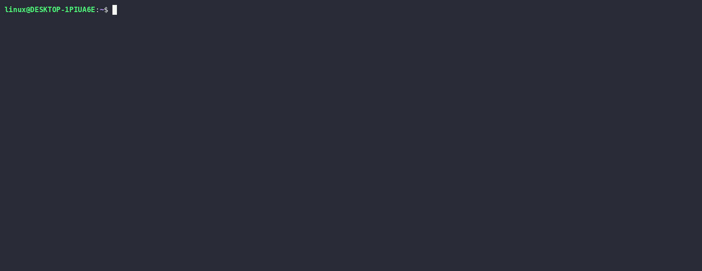

<div align="center">
  
  <p><strong>CLI-oriented Agent Runtime</strong></p>
</div>
<div align="center">
  
  <a href="https://github.com/s0duku/phi-agent/actions/workflows/ci.yml">
    
  </a>
</div>

---


 

## Phi Runtime

**Phi is a CLI-oriented Agent Runtime written in Rust.** The CLI is its primary
operational interface, rather than a thin wrapper around a hidden interactive UI
or service. Sessions, agent evaluation, recovery, and persistent terminal jobs
are exposed as commands with explicit, serializable inputs and outputs.

This makes the runtime usable as a standalone agent and as a composable command
in scripts, pipelines, CI jobs, and other programs:

```text
config + command + PhiHome -> runtime setup
Session -> one agent step -> Session
terminal job request -> typed job status and output
```

The Rust library in [`phi/`](phi/) defines these semantics. The CLI delegates to
the same library operations, so command-line composition does not introduce a
second execution model.

## Core Interfaces

### Session as the CLI boundary

A `Session` is Phi's durable, serializable state and the boundary between the
CLI and the agent runtime. Session commands are explicit ownership-consuming
transformations: they read one Session, apply one operation, and write the new
Session either to the same file or to stdout.

- `session new` creates initialized state.
- `session append` adds user or assistant messages to the current outer delta.
- `session next` and `session replace` reproduce the corresponding step-frame
  transitions without running the agent.
- `session tool-result` resolves the current executor request with an externally
  supplied result.
- `session peek`, `history`, `rollback`, and `delete` inspect or manage state.

This interface lets a shell script, a human, or another program inspect and
modify a Session between agent steps without bypassing Session semantics.

### Atomic agent evaluation

Phi treats agent execution as step-by-step evaluation of serialized ReAct
expressions.

- `step` advances a Session by exactly one atomic agent step.
- `run` repeatedly applies that same step operation until the next run boundary.
- `yolo` repeatedly applies it through Phi's default continuation and recovery
  policy.

Failures and context compaction remain explicit step state. Each completed CLI
operation persists the resulting Session, so evaluation can be inspected,
rolled back, resumed, or driven by a different scheduler.

### One HeadlessTerminal job interface

Persistent shell and REPL processes use the same HeadlessTerminal job API at
every boundary. The `phi headlessterm exec`, `access`, and `close` commands call
the Rust `HeadlessTerminal::exec_job`, `access_job`, and `close_job` operations
directly. Their JSON outputs preserve the library return shapes:
`(Option<JobHandle>, JobInfo)`, `JobAccessResult`, and `JobInfo`, respectively.

The built-in `bash_job`, `job_interact`, and `job_close` tools also use this API.
Their tool-result envelope preserves the same handle, output, truncation, wait,
and job-status semantics, including the distinction between exited jobs,
settled output, screen samples, and elapsed waits. CLI users and agents therefore
observe the same terminal lifecycle instead of separate terminal abstractions.

## Documentation

The full architecture, runtime semantics, CLI workflows, private protocols, and
development invariants are maintained in the [Phi Book](book/src/introduction.md).

## Why CLI-oriented

- **Composable state:** Session JSON can cross process boundaries through
  stdin/stdout or remain in a file for repeated commands.
- **Auditable execution:** one atomic `step` is the common evaluation unit behind
  the higher-level schedulers.
- **Persistent terminals:** jobs can survive individual tool calls and support
  GDB, shells, and other interactive processes.
- **Host or container execution:** Phi can operate in the host environment or
  enter an already-running container without placing the Phi runtime inside it.
- **Structural rollback:** the S-expression-style step structure makes rollback
  an explicit Session transformation.

For example, an existing container can be used as the command environment:

```bash
docker run -dit --name phi-test-run docker.io/library/alpine /bin/sh
phi yolo --user "list files" --container phi-test-run
```


## Config

Example OpenAI-compatible setup:

```bash
export PHI_PROVIDER=openai_chat
export PHI_MODEL=gpt-5
export PHI_KEY=your_api_key
export PHI_SYSTEM=""
```

Or use `~/.phi/config.yml` with the typed YAML schema:

```yaml
model:
  name: gpt-5
provider:
  kind: openai_chat
  api_key: your_api_key
runtime:
  system: ""
```

Use `--config FILE` to replace the config location supplied by Phi Home for a
command. `PHI_*` environment variables are applied last and therefore override
either YAML source.

## Sessions

Without an explicit session path, Phi uses stdin/stdout as a session transport:

```bash
phi run --user "Hello"
cat session.json | phi step
```

In pipeline mode:

- no Session input starts a new Session only when `--user` or `--assistant` is present
- empty stdin without a message prints command help
- non-empty stdin is parsed as session JSON
- stdout emits the updated session JSON

If you pass `[SESSION]`, Phi switches to file-backed session mode:

```bash
phi session new work.session
phi run work.session --user "Hello"
echo "follow up" | phi run work.session
```

In file-backed mode:

- the file must already exist; create it explicitly with `phi session new SESSION`
- the updated session is written back to the same file
- stdin is treated as plain user text, not session JSON

## Commands

Main commands:

- `phi step [SESSION]`
- `phi run [SESSION]`
- `phi yolo [SESSION]`
- `phi session peek [SESSION]`
- `phi session next [SESSION] --provider`
- `phi session replace [SESSION] --provider`
- `phi session tool-result [SESSION] (--json JSON|--text TEXT)`
- `phi session rollback [SESSION]`
- `phi session append [SESSION] (--user TEXT|--assistant TEXT)`
- `phi headlessterm exec|access|close`
- `phi doctor`
- `phi session new SESSION`
- `phi session history [SESSION]`
- `phi home new|pack|unpack`

Examples:

```bash
phi step --user "Inspect the repository"
phi run --quiet --user "Summarize the bug"
phi yolo work.session --user "Keep going until done"
phi session peek work.session
phi session next work.session --provider
phi session replace work.session --provider
# When peek reports RequestExecutor, resolve its first pending call externally:
phi session tool-result work.session --text "external tool output"
phi session rollback work.session
phi doctor
phi session new work.session
phi session history work.session
```

HeadlessTerminal commands expose the library job API as JSON:

```bash
phi headlessterm exec --wait-ms 1000 -- sh -lc 'printf ready'
phi headlessterm access JOB_HANDLE --wait-ms 1000
phi headlessterm access JOB_HANDLE --data 'continue' --write-only
phi headlessterm close JOB_HANDLE
```

## Home

Phi mounts a concrete `PhiHome` before building the runtime.

Home resolution:

- `--home PATH` wins if provided
- a directory path is mounted as a local home
- a sqlite home file such as `.phihome` is mounted directly
- without `--home`, Phi checks `cwd/.phi` first, then falls back to the user home location

Phi can manage both directory homes and packed sqlite homes:

```bash
phi home new .phi
phi home pack .phi -o my.phihome
phi home unpack my.phihome -o unpacked.phi
phi --home my.phihome doctor
```

## Compact And Recovery

Phi includes built-in governance modules for:

- step budgets
- tool execution limits
- model retry boundaries
- loop guard
- automatic context compaction

Auto-compact triggers when rendered provider-visible history approaches the configured context limit. Compact is still a normal step transition, so failures remain visible in session state and can be resumed by later scheduler steps.

## Tools

Builtin tool execution is part of the same runtime step model. Tool calls are staged in the session step state first and only committed to history after execution completes.

## Notes

- `run` stops at the next boundary.
- `yolo` continues through Phi's default failed-session recovery path.
- `session peek` reports the current session eval state and governance status as JSON.
- `doctor` reports initialized runtime status, system prompt, home, and exposed tools.

## Local Build

Workspace aliases are defined in [.cargo/config.toml](.cargo/config.toml).

Build examples:

```bash
cargo build-linux-x64-static
cargo test-linux-x64-static

cargo build-windows-x64-static
cargo test-windows-x64-static

cargo build-macos-arm64-release
cargo test-macos-arm64-release
```

Install helpers currently install the workspace binary locally:

```bash
cargo install-linux-x64-static
cargo install-windows-x64-static
cargo install-macos-arm64-release
```

Or through `xtask` directly:

```bash
cargo run -p xtask -- install --target x86_64-unknown-linux-musl --offline
```

## Release Packaging

The CI workflow builds Linux, Windows, and macOS artifacts.

Current packaged release archives are named after the repository, while their contents remain product-focused under `phi/`, including:

- the `phi` binary
- the workspace `README.md`
- `assets/phi-logo.svg`
- bundled `.phi/` content when present in the repository

Archives are published as:

- `phi-agent-linux-x64.tar.gz`
- `phi-agent-windows-x64.zip`
- `phi-agent-macos-arm64.tar.gz`

Recommended release flow:

- regular `push` and `pull_request` runs only build and test
- pushing a version tag like `v0.1.0` builds artifacts and publishes them to this repository's GitHub Release
- if you need to republish an existing tag manually, run `workflow_dispatch` and fill in `release_tag`
